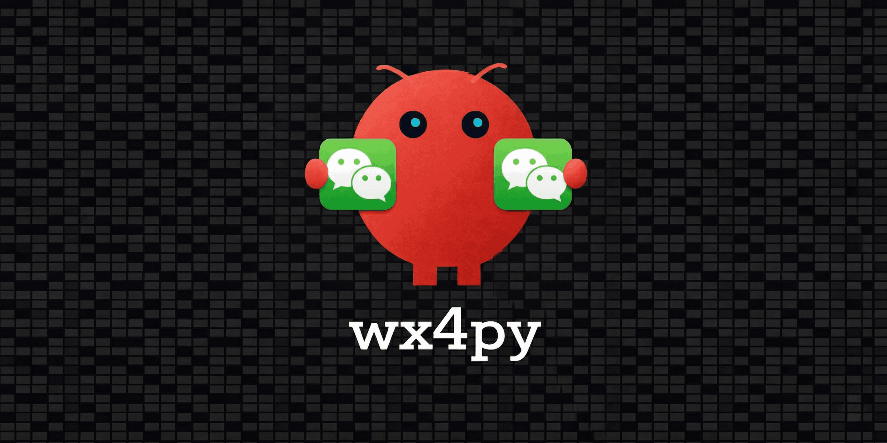

<p align="center">
  
</p>

<p align="center">访问官网查看演示视频：<a href="https://wx4py.biglongxia.com/">wx4py.biglongxia.com</a></p>

<p align="center"><strong>让微信4.x自动化变得简单</strong></p>

<p align="center">
  <a href="https://www.python.org/downloads/"></a>
  <a href="https://pypi.org/project/wx4py/"></a>
  <a href="./LICENSE"></a>
  <a href="https://www.microsoft.com/windows"></a>
  <a href="https://weixin.qq.com/"></a>
</p>

---

## 你是否遇到过这些场景？

- 🔁 **每天给多个群发相同通知** —— 手动一个个发送，浪费时间又容易漏掉
- 📁 **同一个文件要分发到多个群** —— 反复拖拽上传，操作繁琐
- ⏰ **想定时发送消息** —— 比如每天下午5点提醒提交日报，但微信没有定时发送功能
- 📊 **需要分析群聊记录** —— 想统计活跃度、提取关键讨论，却没法导出数据
- 🛠️ **批量管理多个群** —— 设置公告、免打扰、置顶，一个个点太麻烦
- 🤖 **想让 AI 帮我操作微信** —— 不想写代码，只想说一句话就完成操作
- 💬 **想做群聊机器人** —— 多个群同时监听，只在被 @ 时调用 AI 自动回复

如果你有以上任何困扰，**wx4py** 可以帮你解决。

---

## wx4py 能做什么？

### 一句话群发通知

```python
from wx4py import WeChatClient

with WeChatClient() as wx:
    wx.chat_window.batch_send(
        ["技术部", "产品部", "运营部"],
        "【通知】明天下午3点开会",
        target_type='group'
    )
```

**效果**：3个群同时收到通知，告别手动逐个发送。

---

### 定时自动提醒

```python
import schedule

def remind_daily_report():
    with WeChatClient() as wx:
        wx.chat_window.batch_send(
            ["研发一组", "研发二组"],
            "【提醒】请提交日报",
            target_type='group'
        )

schedule.every().day.at("17:00").do(remind_daily_report)
```

**效果**：每天下午5点自动发送，无需人工介入。

---

### 文件批量分发

```python
with WeChatClient() as wx:
    # 一份周报，发送到3个部门群
    wx.chat_window.send_file_to(
        "技术部", r"C:\周报\weekly.pdf", target_type='group'
    )
    wx.chat_window.send_file_to(
        "产品部", r"C:\周报\weekly.pdf", target_type='group'
    )
    wx.chat_window.send_file_to(
        "运营部", r"C:\周报\weekly.pdf", target_type='group'
    )
```

**效果**：同一文件快速分发到多个群，省去反复上传的麻烦。

---

### 群公告一键更新

```python
with WeChatClient() as wx:
    # 批量更新多个群的公告
    for group in ["项目群A", "项目群B", "项目群C"]:
        wx.group_manager.modify_announcement_simple(
            group,
            "本周重点：完成用户模块开发"
        )
```

**效果**：多个群的公告同时更新，保持信息同步。

---

### 聊天记录导出分析

```python
import pandas as pd

with WeChatClient() as wx:
    messages = wx.chat_window.get_chat_history(
        "项目讨论组",
        target_type='group',
        since='week'  # 本周的聊天记录
    )

    # 导出为 CSV
    df = pd.DataFrame(messages)
    df.to_csv("chat_history.csv", index=False)

    # 统计消息类型分布
    print(df['type'].value_counts())
```

**效果**：聊天记录导出为 CSV，可用 Excel 打开分析。

---

### 群成员列表获取

```python
with WeChatClient() as wx:
    members = wx.group_manager.get_group_members("技术交流群")
    print(f"群成员数: {len(members)}")
    # ['张三', '李四', '王五', ...]
```

**效果**：一键获取完整成员列表，可用于统计分析。

---

### AI 群聊机器人自动回复

```python
from wx4py import AIClient, AIConfig, AIResponder, AsyncCallbackHandler, WeChatClient

groups = ["测试龙虾1", "测试龙虾2", "测试龙虾3"]

ai = AIClient(
    AIConfig(
        base_url="https://api.siliconflow.cn/v1",
        api_format="completions",
        model="Pro/deepseek-ai/DeepSeek-V3.2",
        api_key="你的 API Key",
        enable_thinking=False,
    )
)

with WeChatClient(auto_connect=True) as wx:
    wx.process_groups(
        groups,
        [
            AsyncCallbackHandler(
                AIResponder(ai, context_size=8, reply_on_at=True),
                auto_reply=True,
            )
        ],
        block=True,
    )
```

**效果**：监听多个群聊，只有被 @ 时才调用 AI 回复；普通消息只监听不打扰。本库发送的回复会自动记录，避免机器人回复触发自己。

<p align="center">
  
</p>

---

### 监听群消息并转发给指定联系人或群

```python
from wx4py import ForwardRuleHandler, GroupForwardRule, WeChatClient

rules = [
    GroupForwardRule(
        source_group="告警群",
        targets=["值班同学"],
        target_type="contact",
        prefix_template="[告警群] ",
    ),
    GroupForwardRule(
        source_group="项目群A",
        targets=["项目群B"],
        target_type="group",
        prefix_template="[项目群A] ",
    ),
]

with WeChatClient(auto_connect=True) as wx:
    wx.process_groups(
        ["告警群", "项目群A"],
        [ForwardRuleHandler(rules)],
        block=True,
    )
```

**效果**：可以监听指定群聊的消息，并把新消息自动转发给指定联系人，或者同步转发到另一个群。适合做告警通知、值班转发、跨群消息同步。

---

### 实时监听联系人消息（区分收发）

```python
from wx4py import MessageStore, WeChatClient

store = MessageStore(max_per_contact=200)

def on_msg(event):
    who = "我" if event.sender == "me" else "对方"
    print(f"[{who}] {event.content}")

with WeChatClient(auto_connect=True) as wx:
    listener = wx.monitor_contacts(
        ["张三"],
        store=store,
        on_message=on_msg,
    )
    # 监听中也可以用 listener.send() 发消息
    listener.send("张三", "你在吗？")
    listener.run_forever()  # 持续监听直到 Ctrl+C
```

**效果**：实时监听 1v1 联系人聊天，自动区分"我"和"对方"的消息，记录精确时间戳，`MessageStore` 按联系人存储完整历史。

---

### 更多便捷操作

| 你想做的事 | 一行代码 |
|-----------|---------|
| 发消息给联系人 | `wx.chat_window.send_to("张三", "你好")` |
| 发消息给群 | `wx.chat_window.send_to("工作群", "收到", target_type='group')` |
| 发文件 | `wx.chat_window.send_file_to("文件传输助手", r"path\file.pdf")` |
| 搜索联系人/群 | `wx.chat_window.search("张三")` |
| 获取群昵称 | `wx.group_manager.get_group_nickname("工作群")` |
| 设置群昵称 | `wx.group_manager.set_group_nickname("工作群", "我的新昵称")` |
| 开启免打扰 | `wx.group_manager.set_do_not_disturb("工作群", enable=True)` |
| 置顶聊天 | `wx.group_manager.set_pin_chat("重要群", enable=True)` |
| 监听/处理多个群聊 | `wx.process_groups(["群1"], [handler], block=True)` |
| 监听群消息并转发 | `wx.process_groups(["群1"], [ForwardRuleHandler(rules)], block=True)` |
| @ 触发 AI 自动回复 | `wx.process_groups(["群1"], [AsyncCallbackHandler(AIResponder(ai, reply_on_at=True), auto_reply=True)], block=True)` |
| 监听联系人消息 | `wx.monitor_contacts(["张三"], store=store, on_message=on_msg)` |
| 监听中发消息 | `listener.send("张三", "你好")` |

---

## 让 AI 帮你操作微信

不想写代码？在 **Claude Code** 或 **OpenClaw** 中直接对话：

```
帮我给文件传输助手发一条消息：测试成功
```

AI 会自动生成代码并执行。详见 [AI Skill 使用指南](#ai-skill-快速使用)。

---

## 为什么选择 wx4py？

| | wx4py | 其他方案 |
|---|---|---|
| **支持微信版本** | 最新 4.x | 多数只支持旧版/Mac版 |
| **安装难度** | pip 一键安装 | 需要配置复杂环境 |
| **使用门槛** | 5分钟上手 | 需要深入了解底层 |
| **稳定性** | 完善的错误处理 | 容易崩溃中断 |
| **监听与回复** | 多群独立窗口监听，发送队列避免抢占 | 通常需自行实现 |
| **AI 集成** | 支持 Claude Code、OpenAI 兼容接口和自定义回调 | 通常需自行封装 |

---

## 快速开始

### 安装

```bash
pip install wx4py
```

### 环境要求

- Windows 10/11
- Python 3.9+
- 微信客户端 4.x（已测试 4.1.7.59、4.1.8.29）

### 第一次使用

```python
from wx4py import WeChatClient

# 连接微信（需要微信已登录并运行）
with WeChatClient() as wx:
    # 给文件传输助手发条消息测试
    wx.chat_window.send_to("文件传输助手", "wx4py 连接成功！")
```

运行后，你的微信会自动发送这条消息。

如果你是开发者，想查看更多调用示例，请参考 [examples/](./examples/) 目录。
如果你想系统查看完整接口说明，请参考 [docs/guide/API_GUIDE.md](./docs/guide/API_GUIDE.md)。

如果你要提交 Issue，请尽量提供微信版本号、wx4py 版本号、详细复现步骤，并附上相关截图或日志，便于定位问题。

---

## AI Skill 快速使用

在 Claude Code 或 OpenClaw 中复制以下内容：

```
安装并使用 wx4py skill。

技能地址：https://raw.githubusercontent.com/claw-codes/wx4py/main/wx4-skill/SKILL.md

1、执行命令 pip install wx4py 安装所需库。
2、将 wx4py skill 安装至本地的 skills 目录，并在工具文档和记忆系统中记录该技能。
3、阅读 skill 文档后，向我说明如何与你进行对话以使用该技能。
```

安装后，直接用自然语言对话：

```
帮我给工作群发消息：明天9点开会
```

AI 会自动完成操作。

---

## 常见问题

<details>
<summary><b>Q: 需要保持微信前台运行吗？</b></summary>

是的，操作时微信窗口需要在前台。建议在专用机器或空闲时段运行自动化任务。

</details>

<details>
<summary><b>Q: 聊天记录能获取发送者吗？</b></summary>

微信 4.x 的 UI 不暴露发送者信息，这是技术限制，暂无法获取。

</details>

<details>
<summary><b>Q: 会被封号吗？</b></summary>

wx4py 模拟真实用户操作，不修改微信客户端。但仍建议：
- 控制发送频率
- 避免大量群发营销内容
- 使用非重要账号测试

</details>

<details>
<summary><b>Q: AI 自动回复会回复所有群消息吗？</b></summary>

不会。推荐使用 `reply_on_at=True`，普通消息只监听和打印，只有群消息 @ 当前群昵称时才会调用回复逻辑。

</details>

<details>
<summary><b>Q: 只能使用 wx4py 内置的 AIClient 吗？</b></summary>

不是。`process_groups()` 接收任意 handler；你可以使用 `AsyncCallbackHandler` 包装自己的 HTTP 客户端、公司内部模型或其他 AI SDK。

</details>

<details>
<summary><b>Q: 支持哪些微信版本？</b></summary>

目前支持微信 4.x 版本，已测试：
- 4.1.7.59
- 4.1.8.29

</details>

---

## 更新记录

完整版本更新说明请查看 [CHANGELOG.md](docs/guide/CHANGELOG.md)。

---

## 许可证

本项目采用 **AGPL-3.0** 许可证，附加商业使用限制。

- ✅ 个人学习、研究、非商业用途
- ❌ 未经授权的商业使用
- 💼 商业授权请联系：sgdygb@gmail.com

详见 [LICENSE](./LICENSE)。

---

## 免责声明

本软件仅用于技术研究和学习目的。使用者需遵守相关法律法规和平台规则。因违规使用导致的任何后果（账号封禁等）由使用者自行承担。

详见 [LICENSE](./LICENSE) 中的完整免责声明。

---

## 致谢

感谢 [linux.do 社区](https://linux.do/) 中相关讨论带来的启发，让这个项目的方向和落地方式逐步清晰起来。

同时也感谢 [wxauto](https://github.com/cluic/wxauto) 项目提供的思路参考，为本项目的实现带来了帮助。

也感谢 [yeafel666](https://github.com/yeafel666) 对窗口连接、搜索体验和最小化能力等改进所做的贡献。

---

<p align="center">
  <a href="https://www.star-history.com/#claw-codes/wx4py&Date">
    
  </a>
</p>

---

<p align="center"><strong>如果这个项目帮你节省了时间，请给一个 Star ⭐</strong></p>

<p align="center">Made with ❤️</p>
